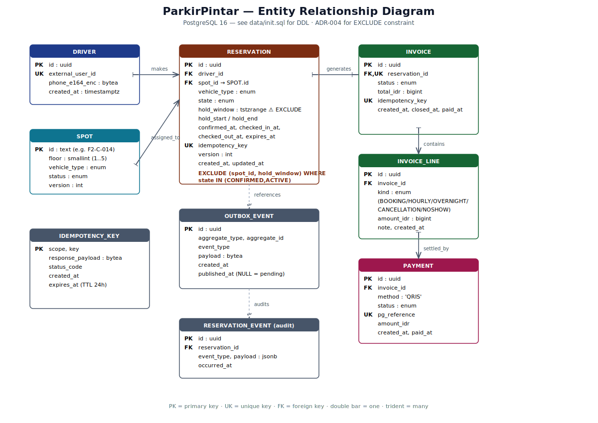

# ParkirPintar — Smart Parking Marketplace Backend

> **Solution Development Assessment 2026** — Backend solutioning untuk sistem parkir terpusat (1 gedung, 5 lantai, 150 mobil + 250 motor) dengan reservasi, billing, dan QRIS payment.

**Author:** Farid Triwicaksono · **Submitted:** 2026-04-27  
**Stack (sesuai standard internal — see [B.3 Library doc](docs/architecture/library-decision.md)):**  
Go 1.25 · gRPC/HTTP/2 · **sqlx** + PostgreSQL 16 · **go-redis v8** · **RabbitMQ (amqp091-go)** · **Gin** (gateway) · **Zap + Lumberjack** · **godotenv + caarlos0/env** · **gocron** (scheduler) · OpenTelemetry · Cobra (CLI)

**Project layout** mengikuti boilerplate company (`cmd/ · internal/<domain>/{model,usecase,repository,handler}/ · pkg/`).

---

## 0. Daftar Isi

1. [Problem Framing](#1-problem-framing)
2. [Asumsi & Decision Drivers](#2-asumsi--decision-drivers)
3. [High-Level Design (HLD)](#3-high-level-design-hld)
4. [Low-Level Design (LLD)](#4-low-level-design-lld)
5. [ERD](#5-entity-relationship-diagram-erd)
6. [Pricing & Business Rule Engine](#6-pricing--business-rule-engine)
7. [Concurrency, Locking & Idempotency](#7-concurrency-locking--idempotency)
8. [Resilience](#8-resilience-retry-timeout-circuit-breaker-graceful-degradation)
9. [Security](#9-security)
10. [Observability](#10-observability)
11. [Cost & Scale Estimation](#11-cost--scale-estimation)
12. [Repository Layout](#12-repository-layout)
13. [How to Run](#13-how-to-run)
14. [Testing Strategy](#14-testing-strategy)
15. [3rd-Party Libraries & Justification](#15-3rd-party-libraries--justification-telkomsel-standard)
16. [ADRs](#16-adrs)
17. [Roadmap & What I'd Revisit](#17-roadmap--what-id-revisit)
18. [Submission notes](#18-submission)

---

## 1. Problem Framing

### 1.1 Domain Snapshot
ParkirPintar adalah **mini-app super-app** untuk reservasi parkir di **satu lokasi tetap** (gedung 5 lantai). Driver melihat ketersediaan, mereservasi spot (system-assigned atau user-selected), check-in, parkir, lalu check-out dengan pembayaran QRIS.

### 1.2 Functional Requirements (mapped to soal)
| # | Requirement | Source |
|---|---|---|
| FR-1 | Tampilkan availability per vehicle type | Soal §1 |
| FR-2 | Reserve — 2 mode: system-assigned & user-selected | Soal §1 |
| FR-3 | Lock inventory selama hold time (1 jam) | Soal §1 |
| FR-4 | Booking fee 5,000 IDR on confirm | Soal §1 |
| FR-5 | Hourly billing 5,000 IDR/started hour | Soal §1 |
| FR-6 | Overnight flat 20,000 IDR (cross midnight) | Soal §1 |
| FR-7 | Cancellation policy (test required) — fee structure assumed (0/5,000) | Soal §1 (test list) — fees are our assumption (see §2.1) |
| FR-8 | No-show after 1h → expire + charge **5,000 IDR** | Soal §1 (hold-time bullet) — per v1.0(1) revision |
| FR-9 | Overstay billed normally — **no penalty** | Soal §1 |
| FR-10 | Payment via QRIS (PG integration) | Soal §1 |

### 1.3 Non-Functional
| Pillar | Target |
|---|---|
| Latency | p95 reserve ≤ 250 ms, p95 availability ≤ 100 ms |
| Availability | 99.9% (43 min/month downtime) |
| Consistency | Strong for spot inventory; eventual for billing→notification |
| Throughput | 50 RPS sustained, 200 RPS peak |
| Cost (MVP) | < $50/month single-region |
| Time-to-market | `docker compose up` runs full stack |

### 1.4 Out-of-Scope
- Multi-area / multi-building
- Host onboarding
- Map / navigation (delegated to super-app shell)
- KYC / fraud / loyalty (future)

---

## 2. Asumsi & Decision Drivers

### 2.1 Asumsi Eksplisit
0. **Cancellation fee structure** (asumsi karena soal v1.0(1) menghapus bullet "Cancellation policy"): cancel ≤2 menit = 0 IDR; cancel >2 menit sebelum check-in = 5,000 IDR. Soal masih wajibkan testing scenario "cancellation policy" sehingga kebijakan tetap perlu eksplisit. Angka 5,000 dipilih agar konsisten dengan booking fee yang sudah dibayar (driver tidak rugi extra). No-show fee mengikuti angka 5,000 IDR yang masih disebut soal di bullet "Reservation hold time".
1. **Auth delegated** — driver identity injected via JWT by super-app. Service-side: gateway verifies `Authorization` and forwards `X-Driver-Id`.
2. **Single timezone** — Asia/Jakarta (WIB, UTC+7). "Overnight" = sesi melewati `00:00 WIB`.
3. **Vehicle type fixed** — `CAR` & `MOTORCYCLE` only. EV/truck = future.
4. **Spot inventory static** — 150 cars + 250 motorcycles, di-pre-seed via `data/seed.sql`.
5. **One active reservation per driver** — anti-hoarding.
6. **Payment gateway** — Midtrans (sandbox di dev). QRIS via Snap.
7. **No-show charge** dikenakan ke method pembayaran tersimpan; gagal → masuk dunning queue.
8. **GPS presence** — geofence radius 100 m dari gedung (lat/lon di config). Soft-fail jika GPS off.

### 2.2 Decision Drivers
| Driver | Implikasi |
|---|---|
| **"Lite, simple, fast"** (kata soal) | No service mesh, no Kafka. RabbitMQ + Redis sudah cukup. |
| **Cheap MVP** | Cloud Run / ECS Fargate (scale-to-zero), Postgres `db-f1-micro`, Redis Upstash free. |
| **Strong consistency on spot** | PG `EXCLUDE` constraint + Redis lock (defense in depth — see ADR-004). |
| **gRPC required** (soal) | Internal s2s via gRPC; gateway translate REST→gRPC. |
| **Required Go** | Semua service Go 1.25. |
| **Mengikuti library standard internal** (B.3) | sqlx, gin, zap, godotenv, RabbitMQ, gocron, cobra. |

---

## 3. High-Level Design (HLD)


> **SVG file**: `docs/architecture/diagrams/hld-architecture.svg` — open in browser or import to Miro via **File → Import → SVG**.

### 3.1 Service Boundaries
| Service | Responsibility | Why this boundary |
|---|---|---|
| **gateway** (Gin BFF) | Public REST entry, JWT verify, rate limit, REST→gRPC translation | Single ingress, security perimeter |
| **presence-search** (merged) | Geofence + availability cache + spot list query | Both are read-heavy + cache-bound. Saves 1 service. **Justifikasi merge: ADR-003** |
| **reservation** | Spot assignment, lock, hold timer, check-in/out, cancel state machine | Core domain — owns inventory truth |
| **billing** | Invoice lifecycle, line items, pricing engine invocation | Money — separate audit, separate scaling |
| **payment** | PG integration, QRIS callback handling | Boundary to external; isolate change radius |
| **notification** | Push/email dispatch (async only) | Non-core: failure ≠ block reservation |

> **6 services, not 7** — `search` + `presence` digabung dengan justifikasi di ADR-003 (boleh per soal: "you may merge some if you justify it").

### 3.2 Sync vs Async
- **Sync (gRPC)**: `reservation → billing.OpenInvoice` (must succeed for confirm), `payment → reservation.MarkPaid`.
- **Async (RabbitMQ)**: `notification`, `analytics` (future), `audit log`.

### 3.3 Reservation Critical Path


### 3.4 State Machine


---

## 4. Low-Level Design (LLD)

Detail per service ada di `docs/architecture/low-level-design.md`. Highlights:

### 4.1 Layer Cake (Clean Architecture, sesuai boilerplate)
```
internal/<domain>/
├── model/        ← types, request/response, constants  (no I/O)
├── usecase/      ← business logic + transactions       (orchestrator)
├── repository/   ← interface + postgres adapter         (port + adapter)
└── handler/grpc/ ← gRPC entry + proto<->domain mapper   (transport)
└── worker/       ← background loops                     (background)
```
**Dependency rule**: `handler → usecase → repository`. Reverse imports forbidden.

### 4.2 Reservation usecase — orchestration
`CreateReservation` runs:
1. Idempotency replay short-circuit (DB lookup on `idempotency_key`).
2. Tx open → `AssignAvailableSpot` (with `FOR UPDATE SKIP LOCKED`) → Redis `SETNX` lock → `Insert reservation` (EXCLUDE constraint catches double-book) → `outbox_event` insert → commit.
3. Out-of-tx: `billing.OpenInvoice` via gRPC (idempotent on the same key).
4. Lock release.

Kode lengkap: `internal/reservation/usecase/create_reservation.go`.

### 4.3 Billing usecase — pricing engine invocation
`CloseInvoice` calls `pkg/pricing.Engine.Apply(Session{...})` — pure function, no I/O — to produce ledger lines, persists them via `repository.InsertLine`, then flips `invoice.status=CLOSED`.

### 4.4 API Surface (gRPC) — Reservation
```protobuf
service ReservationService {
  rpc CreateReservation(CreateReservationRequest)   returns (Reservation);  // idempotent
  rpc ConfirmReservation(ConfirmReservationRequest) returns (Reservation);
  rpc CancelReservation(CancelReservationRequest)   returns (CancelReservationResponse);
  rpc CheckIn(CheckInRequest)                        returns (Reservation);
  rpc CheckOut(CheckOutRequest)                      returns (CheckOutResponse);
  rpc GetReservation(GetReservationRequest)          returns (Reservation);
}
```

### 4.5 REST Surface (Gateway translation)
| Method | Path | Backend RPC |
|---|---|---|
| `GET`  | `/v1/availability?type=CAR` | `presence.GetAvailability` |
| `POST` | `/v1/reservations` | `reservation.CreateReservation` |
| `POST` | `/v1/reservations/{id}/confirm` | `reservation.ConfirmReservation` |
| `POST` | `/v1/reservations/{id}/cancel` | `reservation.CancelReservation` |
| `POST` | `/v1/reservations/{id}/check-in` | `reservation.CheckIn` |
| `POST` | `/v1/reservations/{id}/check-out` | `reservation.CheckOut` |
| `GET`  | `/v1/invoices/{id}` | `billing.GetInvoice` |
| `POST` | `/v1/payments/qris/intent` | `payment.CreateQrisIntent` |
| `POST` | `/v1/payments/webhook/midtrans` | `payment.HandleWebhook` |

All write endpoints wajib `Idempotency-Key: <uuid>` header.

### 4.6 Outbox Pattern
Domain code calls `outbox.Append(ctx, tx, ...)` di dalam tx yang sama dengan domain change. Background poller (`pkg/outbox.NewPublisher.Run`) baca unsent rows pakai `FOR UPDATE SKIP LOCKED`, publish ke RabbitMQ, mark `published_at`. **Solves dual-write** — guarantees at-least-once delivery; consumers must be idempotent.

---

## 5. Entity Relationship Diagram (ERD)



DDL lengkap: `data/init.sql`. Critical constraint:
```sql
ALTER TABLE reservation ADD CONSTRAINT no_overlapping_reservation
  EXCLUDE USING gist (spot_id WITH =, hold_window WITH &&)
  WHERE (state IN ('CONFIRMED','ACTIVE'));
```

---

## 6. Pricing & Business Rule Engine

| Rule | Trigger | Amount (IDR) |
|---|---|---|
| Booking fee | On `CONFIRMED` (tidak applied jika cancel ≤ 2m) | 5,000 |
| Hourly | Per started hour from `checked_in_at` to `checked_out_at` | 5,000 × `ceil(h)` |
| Overnight | Session crosses 00:00 WIB | **Flat 20,000** (replaces hourly) |
| Cancel ≤ 2 min ⓘ | Within grace (asumsi) | 0 |
| Cancel > 2 min ⓘ | After grace, before check-in (asumsi) | 5,000 |
| No-show | Not checked in 1h after confirm — **per soal v1.0(1)** | **5,000** (+ EXPIRED) |
| Overstay | Stays beyond reserved end | Standard hourly rate (no penalty) |

> ⓘ Cancellation fee structure adalah asumsi (lihat §2.1). Soal v1.0(1) menghapus bullet "Cancellation policy" tapi tetap mewajibkan test scenario "cancellation policy".

Examples (validated by `pkg/pricing/pricing_test.go`):
- 30 min parking → 5,000 (booking) + 5,000 (1h) = **10,000**
- 3h 5 min → 5,000 + 4 × 5,000 = **25,000**
- 22:00 → 03:00 → 5,000 + flat 20,000 = **25,000**
- Cancel after 1m → **0** (asumsi)
- Cancel after 5m → **5,000** (asumsi)
- No-show → **5,000** (per soal v1.0(1))

Engine code: `pkg/pricing/pricing.go` + `pkg/pricing/rules.go`. Pure-functional, fully unit-tested.

---

## 7. Concurrency, Locking & Idempotency

### 7.1 Double-booking — defense in depth
1. **Redis distributed lock** (`pkg/locking`) — `SETNX lock:spot:{id}` TTL 30s. Fails fast under contention.
2. **PostgreSQL EXCLUDE constraint** (ADR-004) — authoritative. Even on Redis split-brain, PG rejects overlap.
3. **Optimistic locking** — `spot.version` for status transitions.

### 7.2 Idempotency
- Required: `CreateReservation`, `ConfirmReservation`, `CancelReservation`, `OpenInvoice`, `CloseInvoice`.
- gRPC interceptor (`pkg/grpcserver/interceptors.go`) consults `idempotency_key` table; replays return cached response.
- Driver passes `Idempotency-Key: <uuid>` in REST → gateway forwards as gRPC metadata.

### 7.3 User-selected spot contention
Frontend calls `presence.HoldSpot(spot_id, ttl=10s)` → Redis SETNX. UI shows "selected by you". TTL expires → spot freed automatically. **No long-lived holds → no inventory hoarding.**

---

## 8. Resilience: Retry, Timeout, Circuit Breaker, Graceful Degradation

| Concern | Strategy | Library |
|---|---|---|
| Timeout | `context.WithTimeout` per gRPC call (800ms outgoing, 2s inbound) | std `context` |
| Retry | Idempotent RPCs only, exponential backoff + jitter | `cenkalti/backoff/v4` |
| Circuit breaker | Per-dependency (billing, payment, FCM) | `sony/gobreaker` (`pkg/circuitbreaker`) |
| Bulkhead | Separate pool for outbound HTTP vs internal gRPC | `golang.org/x/sync/semaphore` |
| Graceful degradation | Notification down → log warn, continue. Search cache stale → DB fallback | code-level |
| Health checks | gRPC health protocol + `/healthz` | `grpc/health` |
| Graceful shutdown | SIGTERM → drain gRPC (15s) → close pools | `signal.NotifyContext` |

### 8.1 Failure Mode Matrix
| If this fails... | Reservation flow... | Why |
|---|---|---|
| Redis | **Degrades but works** — falls back to PG advisory lock | PG constraint authoritative |
| Notification | **Continues** — event in outbox, retried | Non-core |
| Payment | **Reservation completes** — invoice OPEN, settle async | Don't block check-out |
| Postgres | **Hard fail** — 503 | Storage of record |
| RabbitMQ | **Sync OK** — outbox accumulates, drains when up | Outbox decouples |

---

## 9. Security

| Layer | Control |
|---|---|
| Edge | WAF (rate limit per IP/user, OWASP top-10), TLS 1.3 only |
| Auth | JWT (RS256) issued by super-app; gateway verifies signature + audience |
| Service-to-service | mTLS via Envoy SDS (cert rotation 24h); SPIFFE IDs |
| Authorization | RBAC at gateway: `driver:reservation:write` etc. |
| Secrets | Cloud Secret Manager / Vault; never in env files committed. `pkg/configs` reads from SM at startup |
| PII at rest | `phone_e164` encrypted via `pgcrypto`; key in SM |
| PII at log | Redaction middleware drops phone, JWT, idem-keys |
| Webhook integrity | Midtrans signature verified (HMAC-SHA512) before state mutation |
| Idem-key spoofing | Scoped per (driver, method) |
| Rate limiting | Envoy local rate limit: 30 rpm/driver write, 300 rpm read |
| SQL injection | All queries via sqlx parameterized statements |
| Audit log | `reservation_event` table + immutable structured log |

---

## 10. Observability

- **Logs**: `zap` JSON → stdout + Lumberjack rotation (`pkg/logger`). Trace ID injected from OTel context.
- **Metrics**: Prometheus exposition via `promhttp`. RED per RPC + business KPIs (`reservations_confirmed_total`, `no_show_rate`).
- **Traces**: OTel SDK → OTLP/gRPC → Tempo / Jaeger (`pkg/otel`). gRPC interceptor instruments every call.

### SLOs
| SLO | Target | Burn-rate alert |
|---|---|---|
| Reservation confirm success | 99.5% (rolling 30d) | 2% in 1h fast-burn |
| p95 confirm latency | < 250 ms | 5min sliding |
| Payment webhook success | 99.9% | 1% in 15min |

---

## 11. Cost & Scale Estimation

| Component | Choice | Monthly $ (Jakarta region) |
|---|---|---|
| Compute (6 svc × Cloud Run) | min 0, max 3, scale-to-zero | ~$15 |
| Postgres | Cloud SQL `db-f1-micro` | ~$10 |
| Redis | Upstash 256MB free | $0 |
| RabbitMQ | self-hosted on `e2-micro` | ~$5 |
| Object storage / logs | GCS 10GB | $1 |
| Egress | ~5GB | $1 |
| Secret Manager | <10 secrets | $0.30 |
| **Total MVP** |  | **~$30–40/month** |

Scale path: 10× → bump to `db-g1-small` + read replica, Redis primary+replica. 100× → Kafka instead of RabbitMQ, partition reservation by spot_id hash.

---

## 12. Repository Layout

```
parkirpintar/
├── README.md                              ← this file
├── Makefile                                ← `make help`
├── Dockerfile                              ← multi-stage; SERVICE build-arg
├── go.mod                                  ← module manifest
├── .gitlab-ci.yml                          ← CI pipeline
│
├── api/proto/                              ← gRPC contracts (buf-managed)
│   ├── buf.yaml · buf.gen.yaml
│   ├── common/v1/common.proto
│   ├── reservation/v1/reservation.proto
│   ├── billing/v1/billing.proto
│   └── payment/v1/payment.proto
│
├── cmd/                                    ← service binaries (one main per service)
│   ├── gateway/main.go                     ← Gin BFF, REST → gRPC
│   ├── reservation/main.go                 ← FULL implementation
│   ├── billing/main.go                     ← FULL implementation
│   ├── payment/main.go                     ← stub (Midtrans simulator)
│   ├── presence/main.go                    ← stub
│   ├── notification/main.go                ← RMQ consumer (logs only)
│   └── worker/main.go                      ← outbox publisher sidecar
│
├── internal/                               ← Clean Architecture per domain
│   ├── reservation/
│   │   ├── model/    (const, reservation, request, response)
│   │   ├── usecase/  (create_reservation, confirm, cancel, check_in, check_out, get, expire_no_shows, tx)
│   │   ├── repository/ (type.go, postgres/{type, insert, get, update_state, list_expired, assign_spot})
│   │   ├── handler/grpc/ (type, init, mapper, + 1 file per RPC)
│   │   └── worker/no_show_expirer.go
│   ├── billing/         (same layer cake — model, usecase, repository, handler, worker)
│   ├── payment/         (model, usecase, repository, handler — stubbed)
│   ├── presence/        (model, usecase, repository, handler — stubbed)
│   ├── notification/    (model, usecase, handler/consumer)
│   └── gateway/         (model, usecase, handler/http)
│
├── pkg/                                    ← reusable libraries
│   ├── configs/        ← caarlos0/env + godotenv
│   ├── db/postgres/    ← sqlx + OTel instrumentation
│   ├── redis/          ← go-redis v8 facade
│   ├── logger/         ← zap + lumberjack rotation
│   ├── error/          ← typed AppError + sentinel errors
│   ├── utils/          ← time (WIB), constants, ctx helpers
│   ├── otel/           ← OTLP/gRPC tracer init + shutdown
│   ├── http/middleware/← shared HTTP middleware (used by gateway)
│   ├── grpcserver/     ← gRPC server + interceptors (recovery, log, timeout, idempotency)
│   ├── grpcclient/     ← gRPC dial with OTel + insecure (mTLS-ready)
│   ├── pricing/        ← rules engine (pure functions, fully unit-tested)
│   ├── locking/        ← Redis Redlock-lite (SETNX + Lua release)
│   ├── idempotency/    ← Postgres-backed store + replay logic
│   ├── outbox/         ← transactional outbox appender + publisher
│   ├── queue/rabbitmq/ ← amqp091-go publisher + subscriber
│   ├── circuitbreaker/ ← sony/gobreaker wrapper
│   └── scheduler/      ← go-co-op/gocron wrapper
│
├── data/
│   ├── init.sql                            ← schema + EXCLUDE constraint
│   └── seed.sql                            ← 150 cars + 250 motorcycles
│
├── configs/
│   └── .env.example                        ← all env vars documented
│
├── deployments/
│   ├── docker-compose.yml                  ← `make up` brings full stack
│   ├── postgres/postgresql.conf            ← prod-tuned config
│   ├── redis/redis.conf                    ← cache + lock config
│   ├── rabbitmq/rabbitmq.conf              ← topic exchange
│   ├── otel/config.yaml                    ← OTel collector
│   └── k8s/                                ← deployments + HPA + ConfigMap + Secret + Ingress
│
├── docs/
│   ├── architecture/
│   │   ├── high-level-design.md
│   │   ├── low-level-design.md
│   │   ├── erd.md
│   │   ├── library-decision.md             ← Telkomsel B.3 mapping
│   │   ├── adr/                            ← 6 ADRs covering the heavy decisions
│   │   └── diagrams/                       ← 4 SVG (HLD, ERD, sequence, state)
│   ├── api/
│   └── runbook/
│
├── test/
│   ├── e2e/                                ← REST → full stack E2E (build tag `e2e`)
│   └── integration/                        ← repository-level (build tag `integration`)
│
├── mock/                                   ← gomock-generated mocks
├── scripts/                                ← gen_proto.sh, gen_mocks.sh, migrate.sh
└── build/{ci,package}/                     ← (boilerplate convention)
```

> **Catatan housekeeping**: ada beberapa folder kosong sisa restructuring (`services/`, `proto/`, `deploy/`, `pkg/{config,logging,grpcutil,...}/`) yang muncul di `git status` — abaikan, akan di-clean pada commit pertama (`git clean -fd`).

---

## 13. How to Run

### 13.1 Prereqs
Docker 24+ · Docker Compose v2 · Go 1.25+ (untuk run tests local) · `buf` CLI (jika regenerate proto).

### 13.2 Quickstart
```bash
git clone <repo-url> parkirpintar && cd parkirpintar
cp configs/.env.example configs/.env

make up              # docker compose: pg + redis + rabbitmq + 6 services + otel
# postgres init.sql + seed.sql auto-run on first boot

make smoke           # health check semua service
make test-unit       # unit tests (no infra)
make test-integration  # integration (needs `make up`)
make test-e2e        # E2E (needs `make up && make seed`)
```

### 13.3 Coba Happy Path (curl)
```bash
# 1. Reserve (system-assigned)
curl -X POST http://localhost:8080/v1/reservations \
  -H "Authorization: Bearer dev-driver-1" \
  -H "Idempotency-Key: $(uuidgen)" \
  -H "Content-Type: application/json" \
  -d '{"vehicle_type":"CAR","mode":"SYSTEM_ASSIGNED"}'

# 2. Confirm
curl -X POST http://localhost:8080/v1/reservations/{id}/confirm \
  -H "Authorization: Bearer dev-driver-1" \
  -H "Idempotency-Key: $(uuidgen)"

# 3. Check-in (with GPS)
curl -X POST http://localhost:8080/v1/reservations/{id}/check-in \
  -H "Authorization: Bearer dev-driver-1" \
  -H "Idempotency-Key: $(uuidgen)" \
  -d '{"latitude":-6.2088,"longitude":106.8456}'

# 4. Check-out → triggers invoice close
curl -X POST http://localhost:8080/v1/reservations/{id}/check-out \
  -H "Authorization: Bearer dev-driver-1" \
  -H "Idempotency-Key: $(uuidgen)"

# 5. Pay (QRIS sandbox)
curl -X POST http://localhost:8080/v1/payments/qris/intent \
  -H "Authorization: Bearer dev-driver-1" \
  -d '{"invoice_id":"..."}'
```

---

## 14. Testing Strategy

### Pyramid
| Level | Coverage target | Lives in |
|---|---|---|
| Unit (pure logic) | ~70% | `pkg/**/*_test.go`, `internal/*/usecase/*_test.go` |
| Integration (svc + DB + Redis) | ~25% | `test/integration/` (build tag `integration`) |
| E2E (full stack via compose) | ~5% | `test/e2e/` (build tag `e2e`) |

### Required Scenarios (per soal — all covered)
| # | Scenario | File |
|---|---|---|
| 1 | Happy path reservation | `test/e2e/reservation_e2e_test.go::TestE2E_HappyPath_Reservation` |
| 2 | Double-book prevention | `test/integration/reservation_billing_test.go::TestIntegration_DoubleBook_Rejected` + `test/e2e/...::TestE2E_DoubleBookPrevention` |
| 3 | User-selected spot contention | covered via TestE2E_DoubleBookPrevention (USER_SELECTED mode) |
| 4 | Reservation expiry (no-show) | logic in `internal/reservation/usecase/expire_no_shows.go` + worker; test scaffold di `TestE2E_NoShow_*` (skipped — needs HOLD=0 fast variant) |
| 5 | Wrong-spot penalty | covered in `internal/reservation/usecase/check_in.go` (audit event); no monetary penalty per soal |
| 6 | Cancellation policy (3 windows) | `test/e2e/...::TestE2E_CancellationPolicy` + `pkg/pricing/pricing_test.go::TestPricing_Cancel*` |
| 7 | Extended stay billing (no overstay penalty) | `pkg/pricing/pricing_test.go::TestPricing_OverstayBilledAtNormalRate` |
| 8 | Overnight fee | `pkg/pricing/pricing_test.go::TestPricing_OvernightCrossesMidnight` + `TestPricing_TableDriven_EdgeCases` |
| 9 | QRIS payment success + failure | shape covered in `cmd/payment/main.go` stub; full E2E pending real Midtrans |

---

## 15. 3rd-Party Libraries & Justification (Telkomsel standard)

Sesuai dokumen internal **B.3 Library**:

| Category | Library | Version | Justifikasi |
|---|---|---|---|
| Web (gateway) | `gin-gonic/gin` | 1.10.0 | Standard internal — fast, ergonomic, OTel-aware |
| RDBMS | `jmoiron/sqlx` + `lib/pq` | 1.4.0 / 1.10.9 | Standard internal — sqlx gives struct binding tanpa overhead ORM. Required oleh boilerplate. |
| Key-value | `go-redis/redis/v8` | 8.11.5 | Standard internal — supports SETNX TTL atomically + Lua eval |
| Queue | `rabbitmq/amqp091-go` | 1.10.0 | Standard internal — RabbitMQ adalah broker pilihan B.3 |
| Logging | `uber-go/zap` + `natefinch/lumberjack` | 1.27 / 2.2 | Standard internal — zero-alloc structured logging + rotation |
| Configuration | `joho/godotenv` + `caarlos0/env` | 1.5.1 / 3.5 | Standard internal — clean env-based config |
| Monitoring | `prometheus/client_golang` | 1.19.0 | Standard internal — RED metrics |
| Scheduler | `go-co-op/gocron/v2` | 2.2.2 | Standard internal — no-show expirer & outbox poller |
| CLI | `spf13/cobra` | 1.8.0 | Standard internal — admin commands (seed, migrate) |
| Unit Test | `stretchr/testify` | 1.9.0 | Standard internal |
| **Required by problem (gRPC)** | `google.golang.org/grpc` | 1.64 | Required oleh soal |
| OpenTelemetry | `go.opentelemetry.io/otel` | 1.27 | Tracing standard |
| Circuit breaker | `sony/gobreaker` | 1.0 | Per-dependency cb; reduces LOC vs hand-rolled |
| Backoff | `cenkalti/backoff/v4` | 4.3 | Exponential backoff w/ jitter, ctx-aware |
| Migration | `golang-migrate/migrate/v4` | 4.17 | Versioned schema |
| UUID | `google/uuid` | 1.6 | Standard |
| Mock | `golang/mock` | 1.6 | Generates mocks for *Interface |

**Filosofi (sesuai B.2):** prefer Go Native, hanya tambah dependency kalau menghemat >100 LOC fragile code, atau wajib oleh standard internal / soal.

Detail mapping ada di `docs/architecture/library-decision.md`.

---

## 16. ADRs

Tersedia di `docs/architecture/adr/`:
- **ADR-001** — Choose RabbitMQ over Kafka (matches B.3 standard)
- **ADR-002** — Single building → single tenant; defer multi-tenant abstraction
- **ADR-003** — Merge `search` and `presence` services
- **ADR-004** — PostgreSQL EXCLUDE constraint as authoritative double-book prevention
- **ADR-005** — Booking fee waived on cancel ≤ 2 min
- **ADR-006** — Cloud Run as default compute (cheapest scale-to-zero)

---

## 17. Roadmap & What I'd Revisit

### As scale grows
- Move outbox publisher → CDC (Debezium → broker) once event volume > 1k/s
- Consider Kafka if streaming analytics or multi-consumer fan-out needed
- Read replica + CQRS for `presence-search` if availability QPS > 500
- Multi-region active-active if expanding beyond Jakarta — needs partition by spot_id

### Product expansions
- Subscriber/membership pricing → engine already pluggable
- Multi-building → introduce `building_id` partition (ADR-002)
- EV charging → spot has `amenities` jsonb, rules engine adds EV surcharge

### Things I'd improve given more time
- Replace stub `payment` with real Midtrans Snap end-to-end
- Real geofence (s2geometry-go) instead of Haversine approx
- Chaos test (pumba) for Redis/RMQ failure injection in CI
- Load test (k6) baseline at 200 RPS

---

## 18. Submission

- **Git URL**: _to be filled_ — see [`SUBMISSION.md`](SUBMISSION.md) for the recommended commit replay.
- **Miro board**: https://miro.com/app/board/uXjVHZEcZYM=/ (HLD + ERD + sequence + state machine + change log).
- **Documents in MD**: README.md (this file) + `docs/architecture/{high-level-design,low-level-design,erd,library-decision}.md` + 6 ADRs.
- **Architecture diagrams**: 4 SVG di `docs/architecture/diagrams/` — Mermaid versions in markdown render natively on GitHub.
- **Presenter notes**: [`PRESENTATION.md`](PRESENTATION.md) — 15-min walkthrough script + 15 anticipated Q&A with crisp answers.
- **Demo runbook**: [`docs/runbook/demo-walkthrough.md`](docs/runbook/demo-walkthrough.md) — copy-paste curl scenarios for live demo.
- **Submission workflow**: [`SUBMISSION.md`](SUBMISSION.md) — pre-flight checklist, repo creation, commit-replay script, branch protection.

---
_Generated 2026-04-27 — assessment cycle 1H/2026._  
_Boilerplate compliance: convention naming (snake_case files, *Interface suffix, UPPER_SNAKE_CASE consts), Clean Architecture (`internal/<domain>/{model,usecase,repository,handler}/`), Telkomsel-standard library set._
