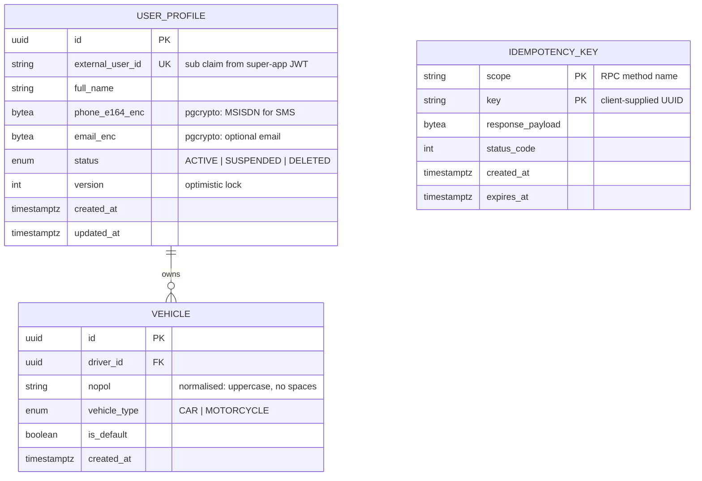

# Entity Relationship Diagram — user-service

Only entities owned by user-service are shown below. Reservation, invoice, and
payment tables live in their respective services' databases.

## Mermaid



## Indexes & Constraints

```sql
-- user_profile
CREATE UNIQUE INDEX uq_user_profile_external_user_id ON user_profile(external_user_id);
CREATE INDEX idx_user_profile_status ON user_profile(status) WHERE status != 'DELETED';

-- vehicle (idempotent registration on (driver_id, nopol))
CREATE UNIQUE INDEX uq_vehicle_driver_nopol ON vehicle(driver_id, nopol);
CREATE INDEX idx_vehicle_driver ON vehicle(driver_id);

-- idempotency_key (composite PK on scope+key, swept by expires_at)
CREATE INDEX idx_idem_expires ON idempotency_key(expires_at);
```

## Why these design choices

- **`pgcrypto` on `phone_e164` and `email`** — UU PDP Indonesia compliance for PII at rest.
  Encrypt/decrypt happens at the repository layer using `PG_CRYPTO_KEY` from Secret Manager.
- **`external_user_id` UNIQUE** — anchors the lazy-registration flow. `UpsertDriver` reads
  by this column first; on miss, inserts. A race on first-touch is resolved by a re-read
  after `UNIQUE` violation.
- **`(driver_id, nopol)` UNIQUE on `vehicle`** — re-posting the same plate is a no-op.
  Re-registering the same plate *with* a different `is_default` flag flips the default;
  re-registering with a different `vehicle_type` updates it.
- **`version`** column on `user_profile` — optimistic lock. `UpdateUser` requires
  `expected_version` from the client; mismatch returns `CONFLICT`.
- **`idempotency_key` keyed by `(scope, key)`** — the same UUID can safely be reused
  across different RPC methods. Cleanup is a cron `DELETE WHERE expires_at < now()`.

## Out of scope (lives in other services)

- Reservation lifecycle, hold-time, EXCLUDE constraint → `reservation-service`
- Invoice ledger, line items → `billing-service`
- Payment intent, QRIS pg_reference → `payment-service`
- Outbox event table → owned by whichever service produces the event
